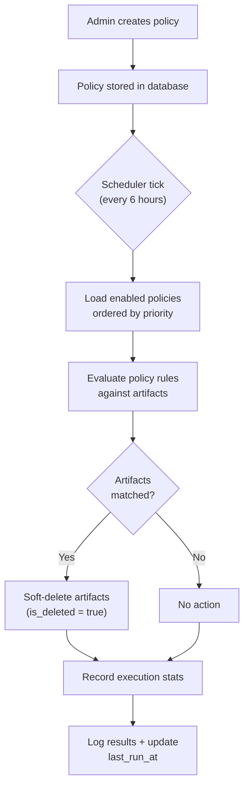
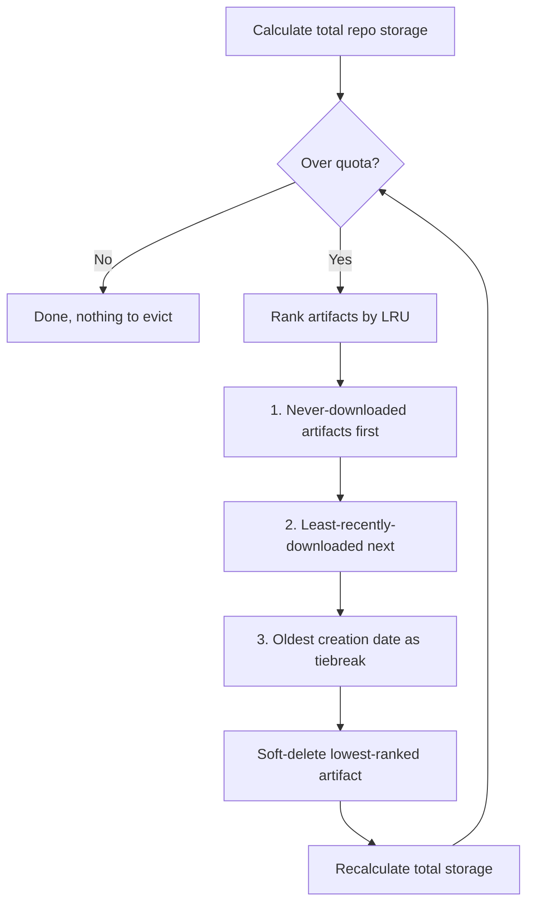
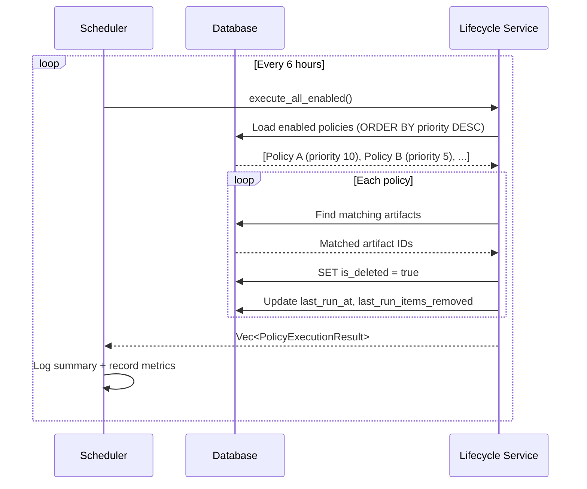

Lifecycle policies let you automate artifact cleanup across your registry. Instead of manually deleting old or unused artifacts, you define rules that the backend evaluates on a schedule, soft-deleting anything that matches.

Policies are scoped globally or per-repository, support dry-run previews, and execute automatically every 6 hours. There are no environment variables to configure. Everything is managed through the Admin API or the web UI.

## How It Works



Policies use **soft deletes**: matched artifacts are flagged as deleted (`is_deleted = true`) rather than physically removed from storage. This means they stop appearing in search results and package resolution immediately, but the underlying data can still be recovered if needed before storage garbage collection runs.

## Policy Types

Six policy types cover the most common retention scenarios:

| Type | Scope | Description |
|------|-------|-------------|
| `max_age_days` | Global or per-repo | Delete artifacts older than N days |
| `max_versions` | Per-repo only | Keep only the N most recent versions per package name |
| `no_downloads_days` | Global or per-repo | Delete artifacts nobody has downloaded in N days |
| `tag_pattern_keep` | Global or per-repo | Keep artifacts matching a regex pattern, delete the rest |
| `tag_pattern_delete` | Global or per-repo | Delete artifacts matching a regex pattern |
| `size_quota_bytes` | Per-repo only | Enforce a storage quota with LRU eviction |

### max_age_days

Removes artifacts created more than a specified number of days ago.

```json
{
  "policy_type": "max_age_days",
  "config": { "days": 90 }
}
```

Useful for: development snapshots, CI artifacts, nightly builds.

### max_versions

Keeps only the N most recent versions of each package within a repository. Older versions are removed. This policy requires a `repository_id` since it groups artifacts by package name within a single repo.

```json
{
  "policy_type": "max_versions",
  "config": { "keep": 5 }
}
```

Useful for: repositories where only the latest few releases matter.

### no_downloads_days

Removes artifacts that haven't been downloaded in N days and are also older than N days. An artifact that was uploaded recently won't be deleted even if it hasn't been downloaded yet.

```json
{
  "policy_type": "no_downloads_days",
  "config": { "days": 180 }
}
```

Useful for: identifying and cleaning up abandoned artifacts that nobody uses.

### tag_pattern_keep

Keeps artifacts whose name matches a regex, deleting everything else. This is an inverse filter: you specify what to keep, and everything that doesn't match gets removed.

```json
{
  "policy_type": "tag_pattern_keep",
  "config": { "pattern": "^(release|stable)-" }
}
```

Useful for: production repositories where only release-tagged artifacts should persist.

### tag_pattern_delete

Deletes artifacts whose name matches a regex. The complement of `tag_pattern_keep`.

```json
{
  "policy_type": "tag_pattern_delete",
  "config": { "pattern": "^(snapshot|dev|alpha)-" }
}
```

Useful for: removing pre-release or development artifacts on a schedule.

### size_quota_bytes

Enforces a per-repository storage limit. When total storage exceeds the quota, artifacts are evicted using an LRU (least recently used) strategy:

1. Artifacts that have **never been downloaded** are evicted first
2. Then artifacts with the **oldest last-download timestamp**
3. Ties are broken by **creation date** (oldest first)

This policy requires a `repository_id`.

```json
{
  "policy_type": "size_quota_bytes",
  "config": { "quota_bytes": 10737418240 }
}
```

The example above sets a 10 GB quota. Eviction continues until total storage drops below the limit.

Useful for: controlling storage costs, preventing any single repository from growing unbounded.

## Eviction Strategy (size_quota_bytes)



## Creating Policies

### Via API

Create a policy with a POST request to `/api/v1/admin/lifecycle`:

```bash
curl -X POST https://registry.example.com/api/v1/admin/lifecycle \
  -H "Authorization: Bearer $ADMIN_TOKEN" \
  -H "Content-Type: application/json" \
  -d '{
    "repository_id": "repo-456",
    "name": "Clean old snapshots",
    "description": "Remove snapshot artifacts older than 30 days",
    "policy_type": "max_age_days",
    "config": { "days": 30 },
    "priority": 10
  }'
```

Response:

```json
{
  "id": "d4e5f6a7-b8c9-4d0e-a1f2-b3c4d5e6f7a8",
  "repository_id": "repo-456",
  "name": "Clean old snapshots",
  "description": "Remove snapshot artifacts older than 30 days",
  "enabled": true,
  "policy_type": "max_age_days",
  "config": { "days": 30 },
  "priority": 10,
  "last_run_at": null,
  "last_run_items_removed": null,
  "created_at": "2026-02-19T10:00:00Z",
  "updated_at": "2026-02-19T10:00:00Z"
}
```

For a **global policy** (applies to all repositories), omit the `repository_id` field.

### Via Web UI

1. Navigate to **Administration > Lifecycle Policies**
2. Click **Create Policy**
3. Select the target repository (or leave blank for global)
4. Choose a policy type and fill in the configuration
5. Set priority and enable/disable
6. Save

## Updating Policies

Use PATCH to modify an existing policy:

```bash
curl -X PATCH https://registry.example.com/api/v1/admin/lifecycle/$POLICY_ID \
  -H "Authorization: Bearer $ADMIN_TOKEN" \
  -H "Content-Type: application/json" \
  -d '{
    "enabled": false,
    "config": { "days": 60 }
  }'
```

You can update `name`, `description`, `enabled`, `config`, and `priority`. The `policy_type` and `repository_id` are immutable after creation.

## Dry-Run Preview

Before executing a policy for real, you can preview what it would do:

```bash
curl -X POST https://registry.example.com/api/v1/admin/lifecycle/$POLICY_ID/preview \
  -H "Authorization: Bearer $ADMIN_TOKEN"
```

Response:

```json
{
  "policy_id": "d4e5f6a7-b8c9-4d0e-a1f2-b3c4d5e6f7a8",
  "policy_name": "Clean old snapshots",
  "dry_run": true,
  "artifacts_matched": 142,
  "artifacts_removed": 0,
  "bytes_freed": 0,
  "errors": []
}
```

In dry-run mode, `artifacts_matched` tells you how many artifacts would be affected, but `artifacts_removed` stays at 0 because nothing is actually deleted. Use this to verify a policy behaves as expected before enabling it.

## Manual Execution

### Execute a Single Policy

Requires admin privileges:

```bash
curl -X POST https://registry.example.com/api/v1/admin/lifecycle/$POLICY_ID/execute \
  -H "Authorization: Bearer $ADMIN_TOKEN"
```

Response:

```json
{
  "policy_id": "d4e5f6a7-b8c9-4d0e-a1f2-b3c4d5e6f7a8",
  "policy_name": "Clean old snapshots",
  "dry_run": false,
  "artifacts_matched": 142,
  "artifacts_removed": 142,
  "bytes_freed": 3758096384,
  "errors": []
}
```

### Execute All Enabled Policies

Run every enabled policy in priority order:

```bash
curl -X POST https://registry.example.com/api/v1/admin/lifecycle/execute-all \
  -H "Authorization: Bearer $ADMIN_TOKEN"
```

Returns an array of `PolicyExecutionResult` objects, one per policy.

## Scheduling

The backend runs a background scheduler that executes all enabled policies automatically. There's nothing to configure:

- **Interval**: Every 6 hours
- **Startup delay**: 60 seconds after the server starts
- **Order**: Policies execute in descending priority order (higher priority number runs first)
- **Error handling**: If one policy fails, the scheduler continues with the remaining policies



## Priority

Each policy has an integer `priority` field (default: 0). Higher values execute first. This matters when policies interact:

- A `tag_pattern_keep` policy at priority 10 runs before a `max_age_days` policy at priority 5
- Artifacts soft-deleted by the first policy won't be counted by the second

Set priority to control the order when you have overlapping policies on the same repository.

## API Reference

All endpoints are under `/api/v1/admin/lifecycle` and require authentication. Execute and execute-all require admin privileges.

| Method | Path | Description |
|--------|------|-------------|
| `GET` | `/` | List all policies (optional `?repository_id=` filter) |
| `POST` | `/` | Create a new policy |
| `GET` | `/:id` | Get a single policy |
| `PATCH` | `/:id` | Update a policy |
| `DELETE` | `/:id` | Delete a policy |
| `POST` | `/:id/execute` | Execute a policy (admin only) |
| `POST` | `/:id/preview` | Preview/dry-run a policy |
| `POST` | `/execute-all` | Execute all enabled policies (admin only) |

## Practical Examples

### Development Repo Cleanup

Keep the latest 10 versions and remove anything older than 14 days:

```bash
# Keep latest 10 versions
curl -X POST https://registry.example.com/api/v1/admin/lifecycle \
  -H "Authorization: Bearer $ADMIN_TOKEN" \
  -H "Content-Type: application/json" \
  -d '{
    "repository_id": "'$DEV_REPO_ID'",
    "name": "Dev: keep latest 10",
    "policy_type": "max_versions",
    "config": { "keep": 10 },
    "priority": 10
  }'

# Also remove anything older than 14 days
curl -X POST https://registry.example.com/api/v1/admin/lifecycle \
  -H "Authorization: Bearer $ADMIN_TOKEN" \
  -H "Content-Type: application/json" \
  -d '{
    "repository_id": "'$DEV_REPO_ID'",
    "name": "Dev: max 14 days",
    "policy_type": "max_age_days",
    "config": { "days": 14 },
    "priority": 5
  }'
```

### Production Repo: Keep Only Release Tags

```bash
curl -X POST https://registry.example.com/api/v1/admin/lifecycle \
  -H "Authorization: Bearer $ADMIN_TOKEN" \
  -H "Content-Type: application/json" \
  -d '{
    "repository_id": "'$PROD_REPO_ID'",
    "name": "Prod: keep releases only",
    "policy_type": "tag_pattern_keep",
    "config": { "pattern": "^v?[0-9]+\\.[0-9]+\\.[0-9]+$" },
    "priority": 10
  }'
```

### Global: Remove Unused Artifacts

Apply across all repositories:

```bash
curl -X POST https://registry.example.com/api/v1/admin/lifecycle \
  -H "Authorization: Bearer $ADMIN_TOKEN" \
  -H "Content-Type: application/json" \
  -d '{
    "name": "Global: remove unused after 6 months",
    "policy_type": "no_downloads_days",
    "config": { "days": 180 },
    "priority": 1
  }'
```

### Storage Budget per Repository

```bash
curl -X POST https://registry.example.com/api/v1/admin/lifecycle \
  -H "Authorization: Bearer $ADMIN_TOKEN" \
  -H "Content-Type: application/json" \
  -d '{
    "repository_id": "'$REPO_ID'",
    "name": "Enforce 50 GB limit",
    "policy_type": "size_quota_bytes",
    "config": { "quota_bytes": 53687091200 },
    "priority": 20
  }'
```

## Best Practices

**Start with dry-run.** Always preview a new policy before enabling it. Check `artifacts_matched` to make sure the scope is what you expect.

**Use priority to layer policies.** A common pattern is a broad `max_age_days` at low priority with a more specific `tag_pattern_keep` at high priority. The keep policy runs first, protecting release artifacts, while the age policy cleans up everything else.

**Scope policies per-repo when possible.** Global policies are convenient but apply the same rule everywhere. Per-repo policies let you set different retention for development, staging, and production repositories.

**Combine complementary types.** `max_versions` and `max_age_days` work well together: versions keeps the recent history tidy while age provides an absolute cutoff. Similarly, `size_quota_bytes` acts as a safety net alongside time-based policies.

**Monitor execution results.** After policies run, the `last_run_at` and `last_run_items_removed` fields on each policy show when it last ran and how many artifacts were cleaned up. Use these to verify policies are working as expected. The scheduler also records cleanup counts in Prometheus metrics (`artifact_keeper_cleanup_total{type="lifecycle"}`).

## Troubleshooting

### Policy isn't deleting anything

- Verify the policy is **enabled** (`GET /api/v1/admin/lifecycle/:id`, check `enabled: true`)
- Run a **preview** to see if artifacts match (`POST /api/v1/admin/lifecycle/:id/preview`)
- For `max_versions`, confirm the policy has a `repository_id` (it won't work as a global policy)
- For `size_quota_bytes`, confirm the policy has a `repository_id`
- Check that artifacts haven't already been soft-deleted by another policy

### Regex patterns aren't matching

- Patterns use PostgreSQL regex syntax (`~` operator), not JavaScript or PCRE
- Test your pattern: `SELECT 'my-artifact-name' ~ '^release-'` in psql
- Remember that `tag_pattern_keep` has **inverse** logic: it deletes what does NOT match

### Scheduler isn't running

- The scheduler starts 60 seconds after server boot. Check server logs for: `"Running scheduled lifecycle policy execution"`
- If the server restarts frequently, policies may never get a chance to run. Ensure uptime is stable.
- You can always trigger execution manually with `POST /api/v1/admin/lifecycle/execute-all`

## See Also

- [Storage Backends](/docs/advanced/storage) for configuring where artifacts are stored
- [Backup & Recovery](/docs/advanced/backup) for protecting data before cleanup
- [Prometheus Metrics](/docs/monitoring/metrics) for monitoring cleanup activity
- [Environment Variables](/docs/reference/environment) for general server configuration
