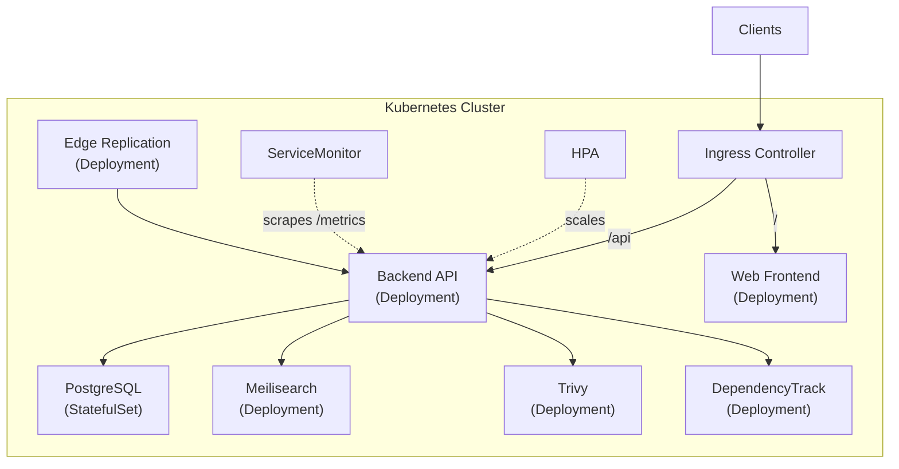

import { Tabs, TabItem } from '@astrojs/starlight/components';

:::caution[Example Configuration]
The Helm chart, Terraform modules, ArgoCD configs, and monitoring stack are provided as **getting started templates**. They should be reviewed and modified to match your specific infrastructure requirements, security policies, and operational needs before use in production.
:::

Deploy Artifact Keeper on Kubernetes using the official Helm chart. The chart includes all services: backend API, web frontend, PostgreSQL, Meilisearch, Trivy, and DependencyTrack.

## Prerequisites

- Kubernetes 1.24+ cluster
- Helm 3.10+
- kubectl configured

## Quick Start

### 1. Add the chart

```bash
git clone https://github.com/artifact-keeper/artifact-keeper-iac.git
cd artifact-keeper-iac
```

### 2. Install with default values (dev)

```bash
helm install ak helm/ \
  --namespace artifact-keeper \
  --create-namespace
```

### 3. Install with production values

```bash
helm install ak helm/ \
  -f helm/values-production.yaml \
  --namespace artifact-keeper \
  --create-namespace \
  --set ingress.host=registry.example.com \
  --set secrets.jwtSecret=$(openssl rand -base64 64) \
  --set externalDatabase.host=your-rds-endpoint.amazonaws.com \
  --set externalDatabase.password=your-db-password
```

## Environment Overlays

The chart ships with three value files:

| File | Use Case | Replicas | PostgreSQL | Features |
|------|----------|----------|------------|----------|
| `values.yaml` | Development | 1 | In-cluster | All services, dev credentials |
| `values-staging.yaml` | Staging | 2 | In-cluster | HPA, PDB, NetworkPolicy, monitoring |
| `values-production.yaml` | Production | 3+ | External (RDS) | HPA, PDB, NetworkPolicy, monitoring, TLS |

## Architecture



## Configuration Reference

### Backend

| Parameter | Description | Default |
|-----------|-------------|---------|
| `backend.enabled` | Enable backend | `true` |
| `backend.replicaCount` | Number of replicas | `1` |
| `backend.image.tag` | Image tag | `dev` |
| `backend.resources.requests.cpu` | CPU request | `250m` |
| `backend.resources.requests.memory` | Memory request | `256Mi` |
| `backend.persistence.size` | Storage size | `10Gi` |
| `backend.autoscaling.enabled` | Enable HPA | `false` |
| `backend.podDisruptionBudget.enabled` | Enable PDB | `false` |

### Database

| Parameter | Description | Default |
|-----------|-------------|---------|
| `postgres.enabled` | Deploy in-cluster PostgreSQL | `true` |
| `postgres.auth.username` | DB username | `registry` |
| `postgres.auth.database` | DB name | `artifact_registry` |
| `postgres.persistence.size` | DB storage | `20Gi` |
| `externalDatabase.host` | External DB host (when postgres.enabled=false) | `""` |
| `externalDatabase.existingSecret` | Use existing K8s secret for DB URL | `""` |

### Security Scanning

| Parameter | Description | Default |
|-----------|-------------|---------|
| `trivy.enabled` | Enable Trivy scanner | `true` |
| `dependencyTrack.enabled` | Enable DependencyTrack | `true` |
| `dependencyTrack.bootstrap.enabled` | Auto-configure DependencyTrack | `true` |

### Ingress

| Parameter | Description | Default |
|-----------|-------------|---------|
| `ingress.enabled` | Enable Ingress | `true` |
| `ingress.className` | Ingress class | `nginx` |
| `ingress.host` | Hostname | `artifacts.example.com` |
| `ingress.tls.enabled` | Enable TLS | `false` |

### Monitoring

| Parameter | Description | Default |
|-----------|-------------|---------|
| `serviceMonitor.enabled` | Enable Prometheus ServiceMonitor | `false` |
| `serviceMonitor.interval` | Scrape interval | `30s` |
| `networkPolicy.enabled` | Enable NetworkPolicy | `false` |

## Production Deployment

For production, we recommend:

1. **Use external PostgreSQL (RDS)** — Set `postgres.enabled: false` and configure `externalDatabase.*`
2. **Use S3 for artifact storage** — Configure S3 env vars in `backend.env`
3. **Enable TLS** — Set `ingress.tls.enabled: true` with cert-manager
4. **Enable monitoring** — Set `serviceMonitor.enabled: true` with kube-prometheus-stack
5. **Enable network policies** — Set `networkPolicy.enabled: true`
6. **Use external secrets** — Use `externalDatabase.existingSecret` for database credentials

## Upgrading

```bash
# Upgrade with new values
helm upgrade ak helm/ \
  -f helm/values-production.yaml \
  --namespace artifact-keeper

# Check rollout status
kubectl rollout status deployment/ak-artifact-keeper-backend -n artifact-keeper
```

## Uninstalling

```bash
helm uninstall ak --namespace artifact-keeper
kubectl delete namespace artifact-keeper
```

## Security Stack

The Helm chart integrates two open-source security scanning tools:

- **[Trivy](https://trivy.dev/)** (Apache 2.0) — Vulnerability scanner for container images, filesystems, and code repositories by Aqua Security
- **[DependencyTrack](https://dependencytrack.org/)** (Apache 2.0) — SBOM analysis platform by OWASP for continuous component risk identification

Both are included in the default deployment and require no additional licensing.
